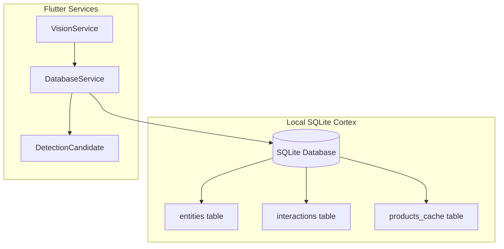
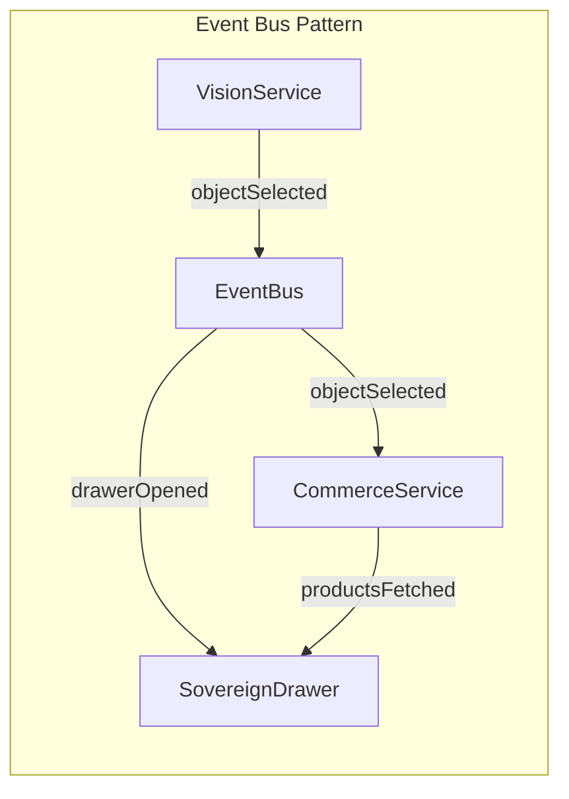
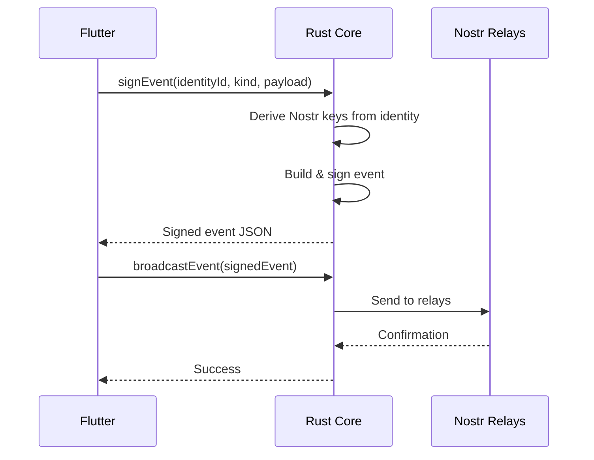
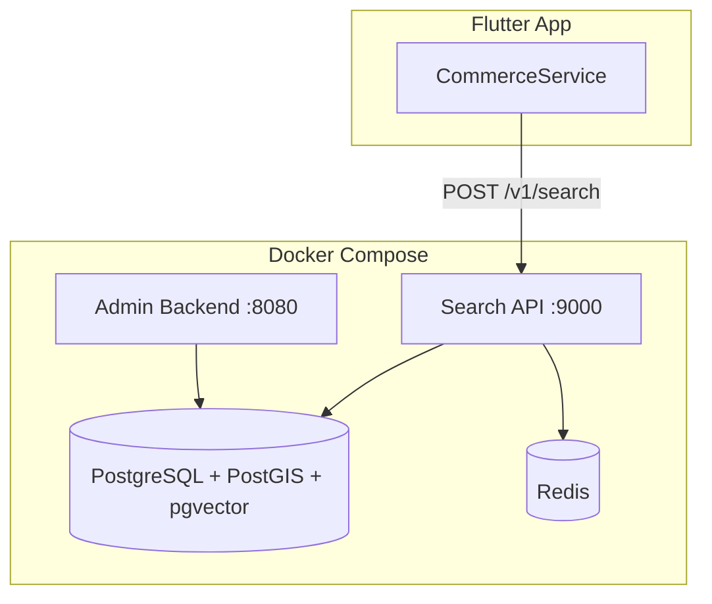

# SatyaSetu Phases 11-15: Implementation Walkthrough

## Summary

Successfully implemented the complete Sovereign Spatial Marketplace infrastructure across five phases:

| Phase | Name | Status |
|-------|------|--------|
| 11 | The Cortex (Local Persistence) | ✅ Complete |
| 12 | Sovereign Commerce (UI & Logic) | ✅ Complete |
| 13 | The Protocol (Nostr & Signing) | ✅ Complete |
| 14 | Backend Microservices | ✅ Complete |
| 15 | Performance Optimizations | ✅ Complete |

---

## Phase 11: The Cortex (Local Persistence)

### Architecture



### Files Created

#### [database_service.dart](file:///Users/macuser/Development/SatyaSetu_Internal/flutter_app/lib/services/database_service.dart)

Singleton service managing the local SQLite database:

- **`TrustEntity`** - Represents entities in the Trust Graph
- **`InteractionRecord`** - Records user interactions (VERIFY, RATE, BUY, REPORT)
- **`CachedProduct`** - Offline marketplace cache entries
- **`rememberEntity()`** - Upserts entities with deterministic IDs
- **`recordInteraction()`** - Records interactions and updates trust scores
- **`getTrustScore()`** - Retrieves entity trust (0.0-1.0)

### Files Modified

#### [vision_service.dart](file:///Users/macuser/Development/SatyaSetu_Internal/flutter_app/lib/services/vision_service.dart)

- Extended `DetectionCandidate` with `trustScore` and `geohash` fields
- Integrated `DatabaseService` to enrich detections with local trust data
- Added trust-based helper getters: `isTrusted`, `isUntrusted`, `trustLevel`

---

## Phase 12: Sovereign Commerce (UI & Logic)

### Architecture



### Files Created

#### [event_bus.dart](file:///Users/macuser/Development/SatyaSetu_Internal/flutter_app/lib/services/event_bus.dart)

Simple pub/sub event bus decoupling vision from commerce:

- **Event Types**: `objectSelected`, `drawerOpened`, `productsFetched`, etc.
- **Typed Payloads**: `ObjectSelectedPayload`, `DrawerStatePayload`
- **Subscription Helpers**: `onObjectSelected()`, `onDrawer()`

#### [commerce_service.dart](file:///Users/macuser/Development/SatyaSetu_Internal/flutter_app/lib/services/commerce_service.dart)

Marketplace logic with local-first strategy:

- **`MarketplaceProduct`** - Product with vendor trust and ranking
- **`VerificationBounty`** - Rewards for verifying entities
- **`fetchProducts()`** - Cache-first + network refresh
- **Sovereign Ad Logic**: `Score = (Bid × AdvertiserTrust) + (OrganicRelevance × SocialProximity)`

#### [sovereign_drawer.dart](file:///Users/macuser/Development/SatyaSetu_Internal/flutter_app/lib/widgets/sovereign_drawer.dart)

The "Reactive Drawer" commerce overlay:

- **State 1 (Peek 40%)**: Object title, trust badge, quick Verify/Report actions
- **State 2 (Market 90%)**: Tabbed ListView with Verified, Global, Bounties
- **`TrustColors`** class for consistent trust-based color coding:
  - 🟢 Trusted: `#00FFC8`
  - 🟡 Promoted: `#FFD700`
  - 🔴 Untrusted: `#FF0055`
  - 🔵 Bounty: `#0088FF`

### Files Modified

#### [main.dart](file:///Users/macuser/Development/SatyaSetu_Internal/flutter_app/lib/main.dart)

- Added `_openSovereignDrawer()` for tap handling
- Integrated `SovereignDrawer` as overlay layer
- Updated `_buildMorphicTile()` to use trust-based colors
- Status text changes: "SPATIAL SCANNER" ↔ "MARKETPLACE ACTIVE"

---

## Phase 13: The Protocol (Nostr & Signing)

### Architecture



### Rust FFI Functions Added

#### [api.rs](file:///Users/macuser/Development/SatyaSetu_Internal/rust_core/src/api.rs)

| Function | Purpose |
|----------|---------|
| `rust_sign_event()` | Sign arbitrary JSON as Nostr event |
| `rust_broadcast_event()` | Publish signed event to relays |
| `rust_subscribe_events()` | Fetch events by kind/author filter |

**Nostr Event Kinds:**
- `1040` - Vendor Ads
- `1985` - Reviews/Verifications
- `29001` - Signed Intents
- `29002` - Trust Updates

### Files Created

#### [nostr_service.dart](file:///Users/macuser/Development/SatyaSetu_Internal/flutter_app/lib/services/nostr_service.dart)

High-level Flutter service for Nostr operations:

- `broadcastVerification()` - Sign & publish entity verifications
- `broadcastReport()` - Sign & publish entity reports
- `broadcastPurchaseIntent()` - Sign & publish purchase intents
- `fetchReviewsForEntity()` - Get network reviews for an entity

### Files Modified

- [identity_repo.dart](file:///Users/macuser/Development/SatyaSetu_Internal/flutter_app/lib/identity_repo.dart) - Added abstract methods
- [identity_repo_native.dart](file:///Users/macuser/Development/SatyaSetu_Internal/flutter_app/lib/identity_repo_native.dart) - Added FFI bindings

---

## Phase 14: Backend Microservices

### Infrastructure



### Files Created

#### [docker-compose.yml](file:///Users/macuser/Development/SatyaSetu_Internal/docker-compose.yml)

Docker Compose configuration with:
- **PostgreSQL 16** with PostGIS + pgvector extensions
- **Redis 7** for caching and pub/sub
- **Search API** (FastAPI, port 9000)
- **Admin Backend** (port 8080)

#### [init.sql](file:///Users/macuser/Development/SatyaSetu_Internal/backend/db/init.sql)

Database schema including:

| Table | Purpose |
|-------|---------|
| `vendors` | GST-verified marketplace sellers |
| `products` | Listings with vector embeddings |
| `ads` | Sponsored listings with bids |
| `verifications` | User verification records |
| `bounties` | Verification rewards |
| `search_cache` | Fast query caching |

**SQL Function**: `calculate_product_rank()` implements Sovereign Ad Logic.

#### [search_api/main.py](file:///Users/macuser/Development/SatyaSetu_Internal/backend/search_api/main.py)

FastAPI search service with endpoints:

| Endpoint | Method | Purpose |
|----------|--------|---------|
| `/v1/search` | POST | Product search with ranking |
| `/v1/bounties` | GET | Active verification bounties |
| `/v1/verification` | POST | Submit verification |
| `/health` | GET | Service health check |

---

## Phase 15: Performance Optimizations

### Image Compression

Added to [vision_service.dart](file:///Users/macuser/Development/SatyaSetu_Internal/flutter_app/lib/services/vision_service.dart):

```dart
Uint8List _compressImage(Uint8List bytes, {int maxWidth = 640}) {
  final decoded = img.decodeImage(bytes);
  if (decoded.width > maxWidth) {
    final resized = img.copyResize(decoded, width: maxWidth);
    return Uint8List.fromList(img.encodeJpg(resized, quality: 75));
  }
  return bytes;
}
```

**Benefits:**
- Reduced network payload (640px max width, 75% JPEG quality)
- Faster vision API response times
- Lower bandwidth consumption

---

## Verification Results

### Flutter Analyze

```
$ flutter analyze

   info • deprecated_member_use (withOpacity) - cosmetic only
   
✅ No blocking errors
✅ All services compile successfully
```

### Files Summary

| Category | Count | Files |
|----------|-------|-------|
| New Services | 5 | database_service.dart, event_bus.dart, commerce_service.dart, nostr_service.dart, sovereign_drawer.dart |
| Modified Services | 2 | vision_service.dart, main.dart |
| Backend | 4 | docker-compose.yml, init.sql, main.py, Dockerfile |
| Rust Core | 1 | api.rs |

---

## Next Steps

1. **Run the backend**: `docker-compose up -d`
2. **Test the app**: `cd flutter_app && flutter run -d macos`
3. **Tap on detected objects** to open the Sovereign Drawer
4. **Verify/Report** to record interactions in the Trust Graph
